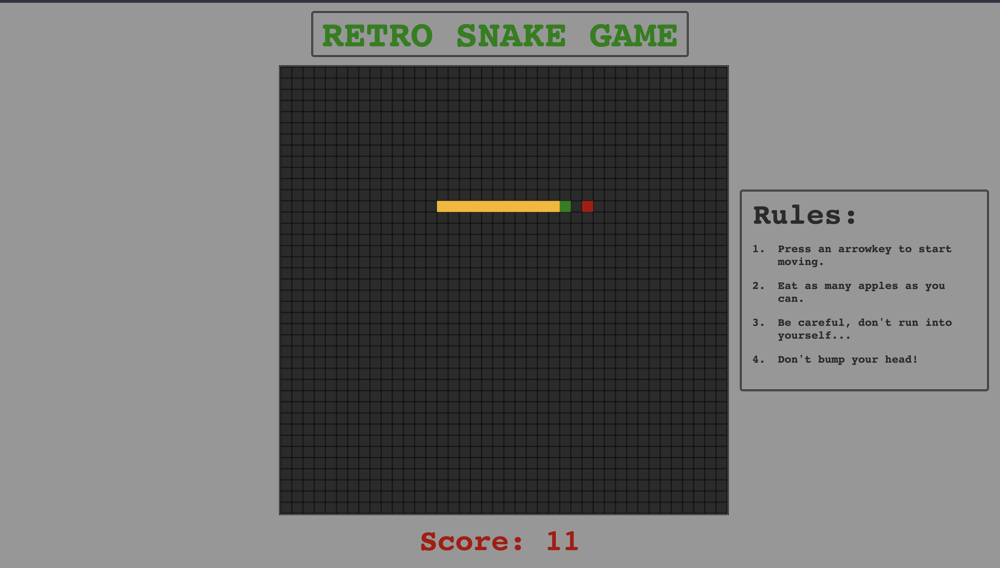

# Retro Snake Game

# Overview

- Retro Snake Game application built entirely with HTML, CSS, and Javascript.
- Have fun playing the original snake game with all of the core functionality from the game we all know and love!
- Utilized setInterval() and HTML \<canvas> to create a retro snake game.

# Website

- Play the game [here](https://brandonchuck.github.io/Retro-Snake-Game/) on Github Pages! 

# Preview

# Summary

The classic snake game was a challenging project for my logic and problem solving skills. In order implement movement, I had to create an algorithm to move each individual piece of the snake, forcing me to take a step back and assess not only the essence of movement in the game, but also the best structure for my code. Using an array of objects with x and y positions was not the first implementation I attempted, but I eventually settled on this method being the most intuitive and cleanest way to center the core functionality around. Although this project helped me progress in several areas including algorithms, DOM manipulation, and game fundamentals, the most valuable skill was how important it is to step step back and think through problems before every touching the keyboard, which is an approach I continuosuly strive to include in all my future projects. At the end of the day, it feels great finishing a game project that reminded me of my childhood playing the snake game on a small flip phone and learning in the process.

- Detailed Features:
    - Control snake head by pressing arrow keys.
      - Detect key presses using onKeyDown event listener.
    - Lose game if head touches the walls.
    - Lose game if head touches the body.
    - Apple relocates to random coordinates after being "eaten".
      - Apple will not relocate to where snake currently is.
    - Used setInterval() to simulate snake motion.
      - Increase or decrease speed by changing the FPS variable.
# Author

Brandon Chuck | Full Stack Developer | [LinkedIn](https://www.linkedin.com/in/brandonchuck/) | [Personal Website](https://www.brandonchuck-dev.com)
